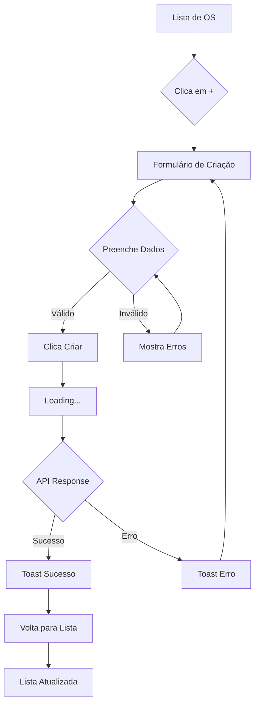

# 📋 Cadastro de Ordem de Serviço - SGOS

## ✨ Funcionalidade Implementada

### 🎯 **Cadastro Completo de OS**
- ✅ **Formulário responsivo** mobile/desktop
- ✅ **Validação em tempo real** dos campos
- ✅ **Seleção de veículos** da base de dados
- ✅ **Campos obrigatórios** marcados
- ✅ **Integração com API** do backend

---

## 📋 Campos do Formulário

### ✅ **Campos Obrigatórios:**
1. **📅 Data** - Data da abertura da OS
2. **🚗 Veículo** - Seleção da lista de veículos ativos
3. **🛣️ Hodômetro** - Quilometragem atual (km)
4. **⚠️ Problema Apresentado** - Descrição detalhada
5. **⚙️ Sistema Afetado** - Sistema do veículo
6. **🔍 Causa da Avaria** - Possível causa do problema

### ⚙️ **Campos com Opções:**
- **🔧 Tipo de Manutenção:**
  - ✅ **Preventiva** (padrão)
  - ✅ **Corretiva**

- **⚙️ Sistema Afetado:**
  - Motor, Transmissão, Freios
  - Suspensão, Elétrico, Ar Condicionado
  - Carroceria, Pneus, Combustível, Outros

---

## 🎨 Interface Responsiva

### 📱 **Mobile (< 768px)**
```
┌─────────────────────────────┐
│ [≡] Nova OS            [×]  │
├─────────────────────────────┤
│ Nova Ordem de Serviço       │
│ Preencha os dados...        │
├─────────────────────────────┤
│ 📅 Data: [2024-01-15]      │
│ 🚗 Veículo: [Toyota ▼]     │
│ 🛣️ Hodômetro: [_____] km   │
│ ⚠️ Problema:               │
│ [________________]          │
│ ⚙️ Sistema: [Motor ▼]      │
│ 🔍 Causa:                  │
│ [________________]          │
│ 🔧 Tipo: [Preventiva ▼]    │
├─────────────────────────────┤
│ [✓ Criar OS]               │
│ [× Cancelar]               │
└─────────────────────────────┘
```

### 💻 **Desktop (> 1024px)**
```
┌─────────────────────────────────────────────────────────┐
│ [≡] Nova Ordem de Serviço                          [×] │
├─────────────────────────────────────────────────────────┤
│                Nova Ordem de Serviço                   │
│              Preencha os dados para criar               │
├─────────────────────────────────────────────────────────┤
│ ┌─────────────────────────────────────────────────────┐ │
│ │ 📅 Data: [2024-01-15]    🚗 Veículo: [Toyota ▼]   │ │
│ │ 🛣️ Hodômetro: [_____] km  ⚙️ Sistema: [Motor ▼]   │ │
│ │ ⚠️ Problema Apresentado:                           │ │
│ │ [_____________________________________________]     │ │
│ │ 🔍 Causa da Avaria:                               │ │
│ │ [_____________________________________________]     │ │
│ │ 🔧 Tipo: [Preventiva ▼]                           │ │
│ │                                                    │ │
│ │        [✓ Criar OS]    [× Cancelar]               │ │
│ └─────────────────────────────────────────────────────┘ │
└─────────────────────────────────────────────────────────┘
```

---

## 🔧 Como Usar

### 1. **Acessar a Funcionalidade**
- **Login** no sistema
- **Menu** → "Ordens de Serviço"
- **Botão [+]** no header (desktop) ou **FAB** (mobile)

### 2. **Preencher o Formulário**
```
✅ Data: Data atual (pré-preenchida)
✅ Veículo: Selecionar da lista
✅ Hodômetro: Quilometragem atual
✅ Problema: Descrição detalhada
✅ Sistema: Selecionar da lista
✅ Causa: Possível causa
✅ Tipo: Preventiva/Corretiva
```

### 3. **Validação Automática**
- ✅ **Campos obrigatórios** destacados
- ✅ **Botão desabilitado** se inválido
- ✅ **Mensagens de erro** contextuais
- ✅ **Feedback visual** em tempo real

### 4. **Criação da OS**
- ✅ **Loading** durante criação
- ✅ **Sucesso** → Volta para lista
- ✅ **Erro** → Mensagem explicativa
- ✅ **Lista atualizada** automaticamente

---

## 📊 Fluxo Completo



---

## 🔐 Controle de Acesso

### 👥 **Quem Pode Criar OS:**
- ✅ **ADMIN** - Acesso total
- ✅ **SUPERVISOR** - Pode criar OS
- ✅ **MECANICO** - Pode criar OS
- ✅ **USUARIO** - Pode criar OS

### 📋 **Dados Automaticamente Preenchidos:**
- ✅ **Data:** Data atual
- ✅ **Usuário ID:** Do usuário logado
- ✅ **Perfil:** Do usuário logado
- ✅ **Status:** "ABERTA" (automático)

---

## 🧪 Como Testar

### 1. **Preparação**
```bash
# Certifique-se que ambos estão rodando:
# Backend: http://localhost:8000
# Frontend: http://localhost:8100
```

### 2. **Teste de Criação**
1. **Login** com qualquer perfil
2. **Menu** → "Ordens de Serviço"
3. **Clique [+]** (header) ou **FAB** (mobile)
4. **Preencha:**
   - Selecione um veículo
   - Digite hodômetro (ex: 45000)
   - Descreva o problema
   - Selecione sistema (ex: Motor)
   - Descreva a causa
   - Escolha tipo de manutenção
5. **Clique "Criar OS"**
6. **Verifique** se aparece na lista

### 3. **Teste de Validação**
- ✅ **Deixe campos vazios** → Botão desabilitado
- ✅ **Preencha gradualmente** → Botão habilitado
- ✅ **Clique "Cancelar"** → Volta para lista

### 4. **Teste Responsivo**
- ✅ **Mobile:** Formulário em coluna única
- ✅ **Desktop:** Layout otimizado
- ✅ **Redimensione** a tela durante uso

---

## 📡 Integração com Backend

### **API Endpoint Utilizada:**
```http
POST /api/v1/ordens-servico/
Authorization: Bearer {token}
Content-Type: application/json

{
  "data": "2024-01-15",
  "veiculo_id": 1,
  "hodometro": "45000",
  "problema_apresentado": "Barulho no motor",
  "sistema_afetado": "Motor",
  "causa_da_avaria": "Possível problema na correia",
  "manutencao": "CORRETIVA"
}
```

### **Resposta Esperada:**
```json
{
  "success": true,
  "message": "Ordem de serviço criada com sucesso",
  "data": {
    "id": 20,
    "data": "2024-01-15",
    "situacao_os": "ABERTA",
    "veiculo_id": 1,
    "usuario_id": 1,
    "perfil": "ADMIN"
  }
}
```

---

## 🎯 Exemplo de Teste Completo

### **Dados de Exemplo:**
```
📅 Data: 2024-01-15
🚗 Veículo: Toyota Hilux - ABC-1234
🛣️ Hodômetro: 45000
⚠️ Problema: Barulho estranho no motor ao acelerar
⚙️ Sistema: Motor
🔍 Causa: Possível problema na correia dentada ou tensor
🔧 Tipo: Corretiva
```

### **Resultado Esperado:**
- ✅ **Toast:** "Ordem de serviço criada com sucesso!"
- ✅ **Redirecionamento:** Volta para lista
- ✅ **Nova OS:** Aparece no topo da lista
- ✅ **Status:** "Aberta" com badge amarelo

---

## 🚀 Próximas Funcionalidades

### 🔄 **Em Desenvolvimento:**
- [ ] **Edição de OS** existentes
- [ ] **Upload de anexos** (fotos, documentos)
- [ ] **Assinatura digital** do responsável
- [ ] **Notificações** de status

### 📈 **Melhorias Planejadas:**
- [ ] **Validação avançada** de hodômetro
- [ ] **Histórico do veículo** na seleção
- [ ] **Templates** de problemas comuns
- [ ] **Geolocalização** automática

---

**🎉 Funcionalidade de Cadastro de OS Completa e Responsiva!**

**Teste agora:**
1. Vá para "Ordens de Serviço"
2. Clique no botão [+]
3. Preencha o formulário
4. Crie sua primeira OS!

**A OS será criada na API real e aparecerá na lista com status "Aberta"!**
